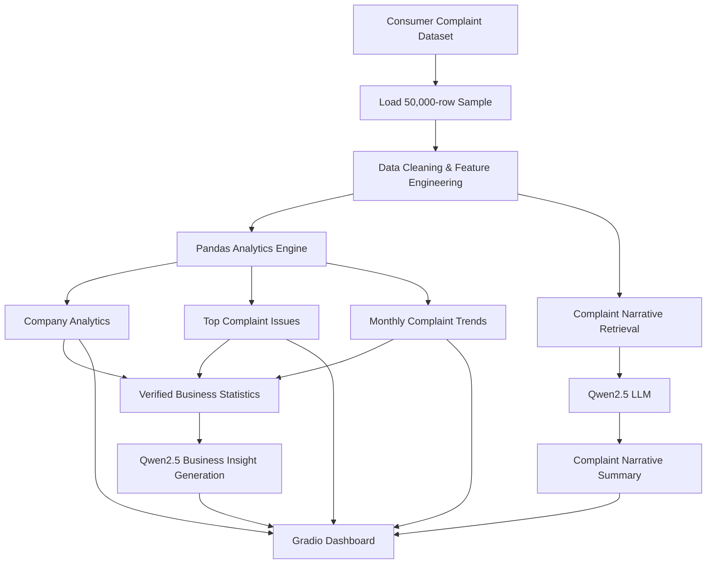

# ComplaintIQ: GenAI Customer Complaint Intelligence Platform

ComplaintIQ is an AI-powered customer complaint intelligence platform that combines deterministic data analytics with Large Language Models (LLMs) to transform customer complaint data into actionable business insights.

The platform leverages **Hugging Face Transformers**, **Qwen2.5-3B-Instruct**, **Pandas**, and **Gradio** to analyse customer complaint data, generate complaint summaries, identify business risks, and produce executive-level reports through an interactive dashboard.

---

## Project Overview

Customer complaints provide valuable information about customer satisfaction, operational issues, regulatory risks, and service quality. However, manually analysing thousands of complaint records is inefficient and time-consuming.

ComplaintIQ addresses this challenge by integrating traditional data analytics with Generative AI.

The platform first performs deterministic analytics using **Pandas** to calculate complaint statistics, issue frequencies, company-level KPIs, and complaint trends. It then uses **Qwen2.5-3B-Instruct** to analyse complaint narratives, summarise recurring issues, and generate executive business reports based on verified analytical results.

This hybrid architecture ensures numerical accuracy while leveraging the reasoning capabilities of Large Language Models for qualitative analysis.

---

# Features

- Company-level complaint analytics
- Customer complaint narrative summarisation
- AI-generated executive business reports
- Complaint trend visualisation
- KPI dashboard
- Top complaint issue analysis
- Interactive Gradio web interface
- Fully executable using free Google Colab resources

---

# Technology Stack

| Category | Technology |
|------------|------------|
| Programming Language | Python |
| Large Language Model | Qwen2.5-3B-Instruct |
| LLM Framework | Hugging Face Transformers |
| Data Analytics | Pandas |
| Data Visualisation | Matplotlib |
| Web Interface | Gradio |
| Development Environment | Google Colab |
| Hardware | NVIDIA Tesla T4 GPU |

---

# Project Architecture



---

# Dashboard

## Company Analytics Dashboard


---

## Complaint Analytics


---

## Executive Business Report


---

# Dataset

This project uses the **Consumer Financial Protection Bureau (CFPB) Consumer Complaint Database**.

The original dataset is approximately **7.8 GB**.

To enable efficient experimentation using the free Google Colab environment, a **5,000-row sample dataset** is included in this repository for demonstration purposes.

---

# Methodology

The project follows a hybrid analytics architecture consisting of two components.

### Deterministic Analytics (Pandas)

Pandas is responsible for all quantitative analysis including:

- Complaint counting
- Company-level KPI calculation
- Complaint trend analysis
- Top complaint issue identification
- Product frequency analysis

### Generative AI (Qwen2.5)

Qwen2.5 performs qualitative analysis by:

- Summarising complaint narratives
- Identifying recurring complaint themes
- Generating executive business reports
- Providing business recommendations

This separation ensures that all numerical statistics originate from deterministic computation while the language model focuses solely on interpretation and explanation.

---

# Installation

Clone the repository

```bash
git clone https://github.com/YOUR_USERNAME/ComplaintIQ-GenAI-Customer-Complaint-Intelligence.git

cd ComplaintIQ-GenAI-Customer-Complaint-Intelligence
```

Install dependencies

```bash
pip install -r requirements.txt
```

Open

```
ComplaintIQ_GenAI_Complaint_Intelligence.ipynb
```

Run the notebook sequentially.

---

# Example Workflow

```
Load Complaint Dataset
        │
        ▼
Clean Dataset
        │
        ▼
Select Company
        │
        ▼
Generate Company Analytics
        │
        ▼
Retrieve Complaint Narratives
        │
        ▼
Generate Complaint Summary
        │
        ▼
Generate Executive Business Report
        │
        ▼
Visualise Results using Gradio Dashboard
```

---

# Skills Demonstrated

- Generative AI
- Large Language Models (LLMs)
- Hugging Face Transformers
- Prompt Engineering
- Natural Language Processing (NLP)
- Data Analytics
- Business Intelligence
- Python
- Pandas
- Gradio
- Data Visualisation
- Interactive Dashboard Development

---

# Future Enhancements

- Retrieval-Augmented Generation (RAG)
- Semantic complaint search
- Multi-company comparison
- PDF executive report generation
- Docker deployment
- Cloud deployment
- Authentication and user management

---

# Repository Structure

```
ComplaintIQ-GenAI-Customer-Complaint-Intelligence/
│
├── ComplaintIQ_GenAI_Complaint_Intelligence.ipynb
├── complaints_sample_5000.csv
├── requirements.txt
├── README.md
├── LICENSE
```

---

# Author

**Aqilah Syahirah**

Master of Science (Computer Science)

Interested in Artificial Intelligence, Machine Learning, Data Science, Natural Language Processing, Explainable AI, and Generative AI.
